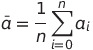
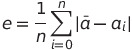

# Pipe leak detector - An simple and innovative mathematical model for detecting water leaks from industrial pipes
### by Anders Haarberg Eriksen, Hilmir Straumland & Åsmund Runningen from team Lilla Neshorn at NorwAI 

[bilde]

Pipe leak detector is a proof of concept that you can use computer vision and a simple mathematical model to detect water leaks in static enviroments. Using a raspberry pi powered picarX with a camera. 

The algorithm is inspired by the formula of standard diviation. 
The Algorithm works by rappidly taking pictures and converting them to grayscale images and then calculating the average pixelvalue of those images before calculating the difference between the average pixel values and the pictures pixel values of alle the images.

This makes the droplets in the pictures stand out from the rest of the image. Which is then used to detect that there is a waterleak in the picture.
(image of the cool thing :d)

