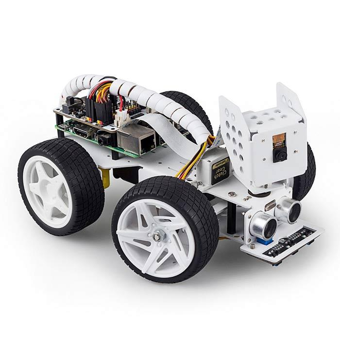
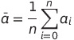
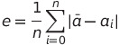
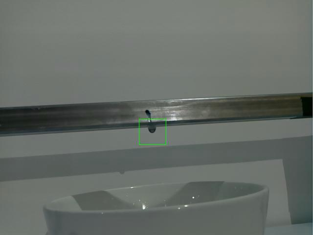

# Pipe leak detector - An simple and innovative mathematical model for detecting water leaks from industrial pipes
### by Anders Haarberg Eriksen, Hilmir Straumland & Åsmund Runningen from team Lilla Neshorn at NorwAI 

Pipe leak detector is a proof of concept that you can use computer vision and a simple mathematical model to detect water leaks in static enviroments. Using a raspberry pi powered picarX with a camera. 

### Problem
The porblem we wanted to try to find a solution to is to find an more effective and cheaper way to find leaks in industrial pipes. The reason this is important is because it can be very expensive and time consuming when pipes leak. So by having our robot you can always detect pipeleaks without having to spend money on inspectors and/or sending them into risky enviroments. 

### Solution
The solution is having our robot walking around with our simple, sensitive, autonome, and robost algorithm that will detect leaks even at the smallest scale. 

### How?
The algorithm is inspired by the formula of standard diviation. 
It works by rappidly taking pictures and converting them to grayscale images and then calculating the average pixelvalue of those images before calculating the difference between the average pixel values and the pictures pixel values of all the images.

This makes the droplets in the pictures stand out from the rest of the image. Which is then used to detect that there is a waterleak in the picture.

To make it easier to detect where there it a droplet. We set a gaussian blur on the image to clear the noice in the image. This make it so that there it a clear white spot on the image for droplets or a line for a flow of water.

We then detect where there is a white mark on the image and then add a green rectange around the detected droplet.

